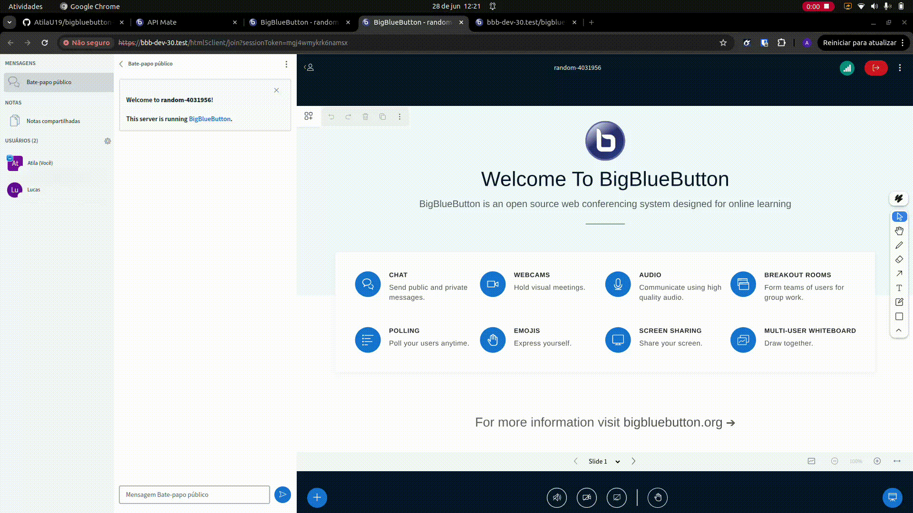

# Chat Mention Plugin

## Description

The Chat Mention Plugin serves as a demonstration of how developers can create their own custom plugins. This plugin basically implements the "mention" feature as you can see down below.



See the **Usage** section of the main README to see how to build and run plugins.

## Configuration Example

Add this to the `settings.yml` of the BBB HTML5-client:

```yaml
public:
  plugins:
    - name: ChatMention
      url: <<PLUGIN_URL>>
```

Where `<<PLUGIN_URL>>` is the URL that points to the location where your bundled `ChatMention.js`-file is hosted.
